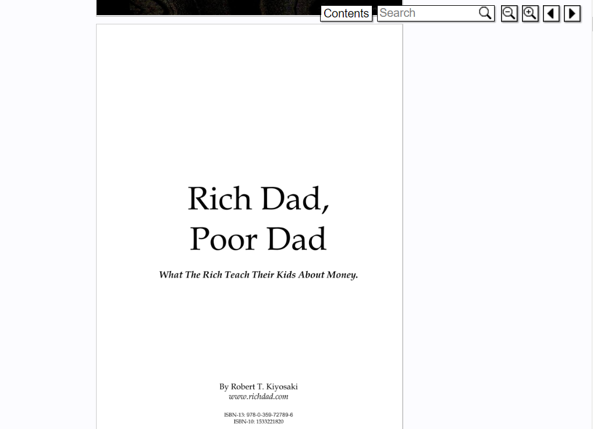

# Prodigy (MVP)
- This project aims to showcase books of all genre to the reading community in a simple platform where they can access and read them.
- [Live Demo](https://Prodigy.netlify.app/)
    - Login credentials:
        - Email - marisolfluffy@gmail.com
        - Password - Bentley1 /Random
- [Blog post]()

## Prodigy Web Architecture

## Editions
- [Prodigy](https://github.com/shalomtash/Prodigy) : written with Vanilla JS and jQuery

## Usage
See [landing page](https://Prodigy.netlify.app)

## Contribution
This is a work in progress insights will be highly appreciated. 

## Screenshots

## Author
A voracious reader who uses books to explore personal growth and developments in information technology and other areas.
A software engineer with an enthusiasm for using technology to solve real-world issues and exceptional leadership motivated by a sense of purpose. I firmly believe that technology can impact society, if it is implemented properly.
By:
[shalomtash]()
github [https://github.com/shalomtash]()